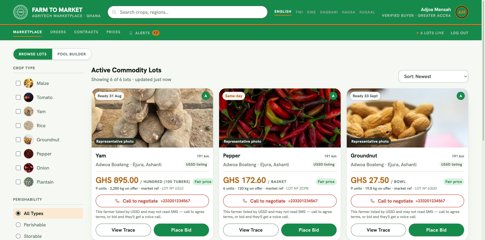
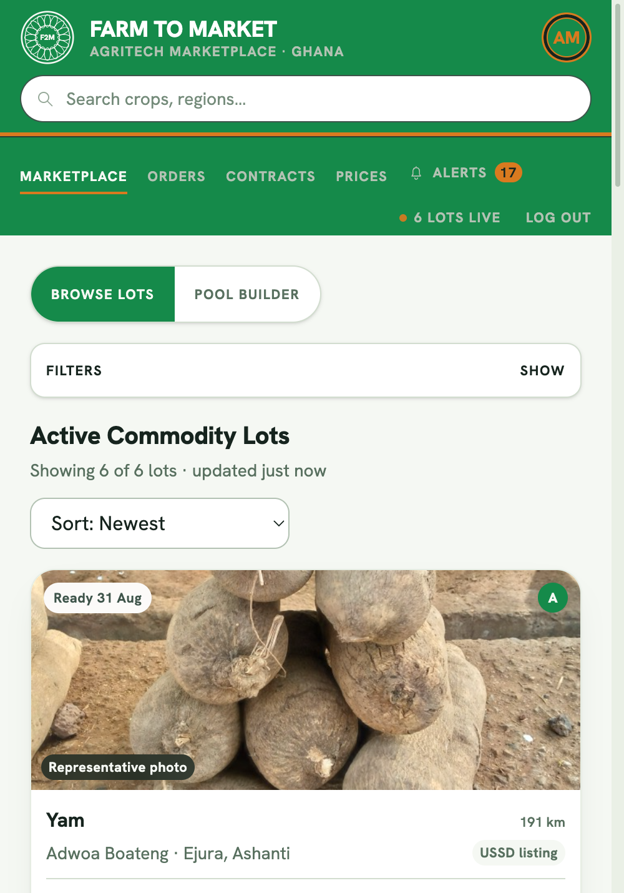
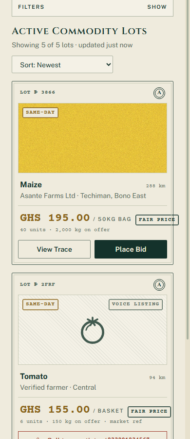
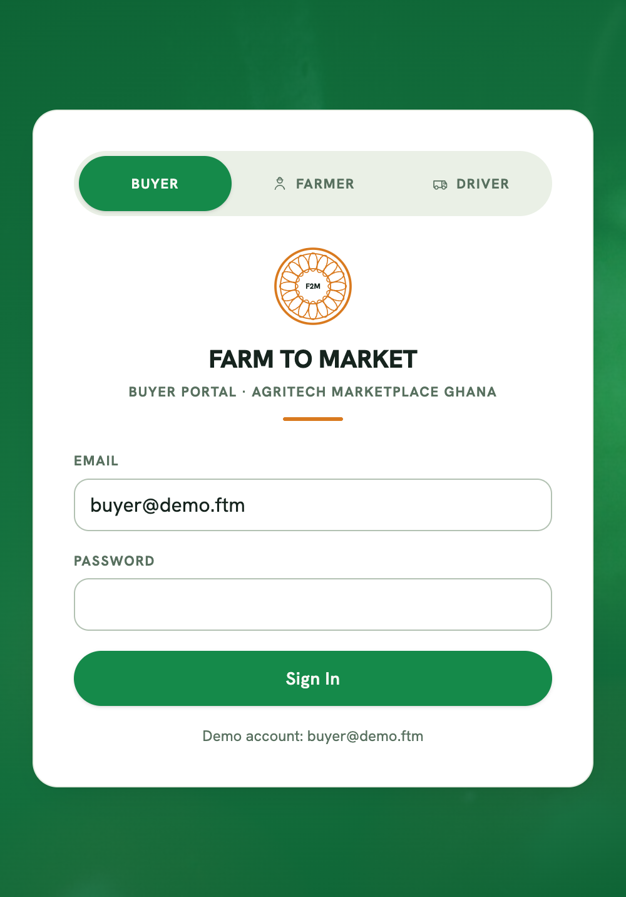
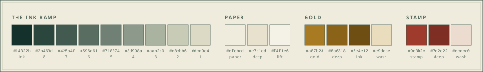
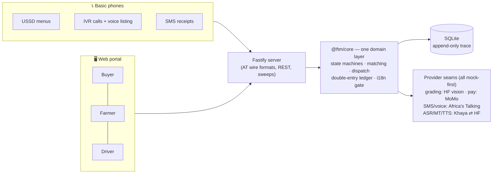

<div align="center">



**A national marketplace connecting Ghanaian farmers to verified buyers —<br/>built so a farmer with a basic phone can use every part of it.**


</div>

One transaction spine, every surface at feature parity: **USSD** menus and an **open-ended voice call** for farmers on a Nokia 105, **outbound IVR** offers (hear it, press 1 to accept), **SMS receipts** for every step, and a **web portal** for buyers, smartphone farmers, and side-hustle drivers — all thin adapters over one domain core and one double-entry ledger.

<div align="center">

</div>

## The product, in three seats

| 🌾 The farmer | 🏛 The buyer | 🚚 The driver |
|---|---|---|
| Registers and lists by USSD, by **one spoken phone call** (ASR → MT → parser → live listing), or on the web with photos. Hears offers as voice calls, accepts with `1`, gets paid to MoMo — with an SMS receipt for everything. | Browses lot **certificates**, bids or posts demands, funds escrow, watches AI grading explain itself criterion by criterion, and hands every counterparty a public **traceability QR**. | Flips ON DUTY, picks routes and a vehicle, takes nearest-first dispatch or direct hires at frozen rate-card quotes — paid from transport escrow on verified delivery. |

## What it looks like

The web portal ships **The Trade Instrument** (D-039): the design grammar of the cedi banknote — intaglio-green ink on banknote paper, engraved line-art, grade seals, rubber stamps, and money set in typewriter figures. Recorded in [`apps/web/DESIGN.md`](apps/web/DESIGN.md).



|  |  |  |
|---|---|---|

<div align="center">

</div>

## Six languages, honestly gated

English, **Twi**, **Eʋegbe**, **Dagbanli**, **Hausa**, and **Kʋsaal**. Catalogs are machine-drafted (Khaya AI / HF models) but the review gate lives inside the translator itself: an unreviewed catalog resolves to English on every real farmer-facing surface — SMS, USSD, IVR — until a native speaker signs it off, while the farmer's chosen language is preserved and switches on retroactively (D-040). New callers pick their language from a menu where **every language names itself**.

## Architecture



```
packages/core       All domain logic: schema, contract + delivery-job state machines,
                    matching, dispatch, ledger, notifications, the i18n review gate,
                    and every provider seam (grading, payment, SMS, voice, ASR, MT, TTS).
apps/server         Fastify: REST API, USSD webhook + IVR voice wire (Africa's Talking
                    formats), MoMo callbacks, sweep jobs, tester pages, demo script.
apps/web            Vite + React portal — The Trade Instrument design system.
docs/               PROJECT.md · DECISIONS.md · BUILDLOG.md — the living record.
```

## Quickstart

Requires Node 24+ (prebuilt binaries for better-sqlite3/sharp — no compiler toolchain).

```bash
npm install
npm run db:reset        # migrate + seed (prints the demo buyer login)
npm run demo            # one lot end to end, fully offline: voice accept + transport leg, exit 0
npm run dev             # server :3000 + portal :5173
npm test                # 170 tests: scorers, state machines, ledger invariants, wire walks
```

Then follow [`DEMO.md`](DEMO.md) for the three-tab demo: the USSD tester and the ringing IVR tester (`localhost:3000/ussd-tester.html`, `/ivr-tester.html`) as the farmer/driver phones, the portal (`localhost:5173`) as the buyer.

## Real providers

Mock mode needs zero keys — every external boundary has a deterministic mock behind the same interface (D-013). To go real, copy `.env.example` → `.env` and flip per layer:

| Layer | Provider | Flip |
|---|---|---|
| AI grading | HF router vision models (live-verified: grade A at 95% on a real photo) | `HF_TOKEN` + `GRADING_PROVIDER=hf` |
| Translation | Khaya AI (GhanaNLP) **or** LLMs via the HF router | `MT_PROVIDER=khaya` \| `hf` |
| Speech-to-text | Khaya AI **or** Whisper on hf-inference | `ASR_PROVIDER=khaya` \| `hf` |
| Text-to-speech | Khaya AI (IVR `<Play>` with `<Say>` fail-open) | `TTS_PROVIDER=khaya` |
| SMS | Africa's Talking (sandbox host auto-selected) | `AT_API_KEY` + `NOTIFY_PROVIDER=at` |
| Voice/IVR | Africa's Talking Voice | `+ AT_VOICE_NUMBER` + `VOICE_PROVIDER=at` |
| USSD | Africa's Talking (service code + tunnel → `/ussd`) | dashboard callback |
| Payments | MTN MoMo sandbox (Collections + Disbursements) | `npm run momo:provision` + `PAYMENT_PROVIDER=momo` |

Catalog drafting: `npm run i18n:draft` (Khaya) or `MT_PROVIDER=hf npm run i18n:draft` (HF LLMs) — drafted catalogs stay behind the native-review gate either way.

## The record

Every architectural choice, with its reasons and its rejected alternatives: [`docs/DECISIONS.md`](docs/DECISIONS.md) (D-001 → D-041). Everything built, in order, with verified counts: [`docs/BUILDLOG.md`](docs/BUILDLOG.md). Vision, MVP criteria, and live status: [`docs/PROJECT.md`](docs/PROJECT.md).

<div align="center">
<sub>Built in Ghana, for the farmer with the smallest phone. 🇬🇭</sub>
</div>
